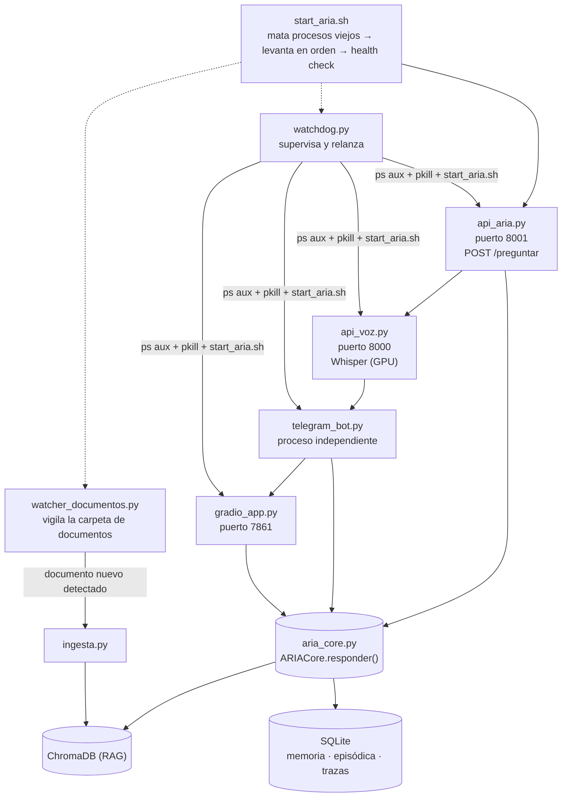
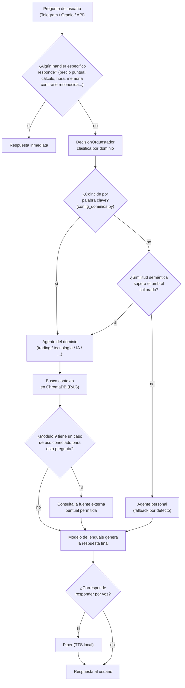

# Arquitectura

Este documento describe cómo está armado ARIA por dentro: sus piezas principales, cómo se conectan, y cómo viaja una pregunta desde que se escribe hasta que se responde. Es una descripción del sistema evolucionado — no coincide del todo con el diseño original de las primeras semanas, y el propio documento señala dónde el diseño real quedó distinto del diseño prolijo que se había planeado.

## Componentes principales

- **`aria_core.py`** — el orquestador central. Contiene el método `responder()`, que es el punto de entrada real de cualquier pregunta.
- **`handlers.py`** — implementa el patrón Handler: cada capacidad puntual del sistema (precio del oro, precio de la plata, tipo de cambio, function calling, índice de sentimiento de mercado, etc.) es una clase con un método `intentar(pregunta, contexto)` que devuelve una respuesta o `None` si no le corresponde a esa pregunta.
- **`decision_orquestador.py`** — decide, cuando ningún handler puntual respondió, a qué dominio general pertenece la pregunta (`DecisionOrquestador.decidir()`) y ejecuta la respuesta correspondiente (`EjecutorOrquestador.ejecutar()`), con un umbral de similitud semántica calibrado en base a pruebas reales.
- **`config_dominios.py`** — el archivo central de palabras clave por dominio, usado tanto por el enrutador general como por los agentes específicos para reconocer de qué está hablando una pregunta.
- **`funciones.py`** — funciones puntuales invocables directamente (hora actual, cálculo, precio de criptomonedas, estado del sistema, listado de archivos recientes, análisis técnico básico), expuestas a través de un handler dedicado.
- **Agentes por dominio** (`agente_trading.py`, `agente_tecnologia.py`, `agente_ia.py`) — cada uno con su propia lógica de búsqueda en la biblioteca de documentos indexada (RAG) para su área.
- **`ingesta.py`** — indexa documentos (PDF, Word, texto, EPUB) en ChromaDB, la base de datos vectorial que sostiene el RAG.
- **Memoria personal** — migrada de un archivo de texto plano a una base de datos real (ver [`/historia/05_memoria_y_conocimiento.md`](../historia/05_memoria_y_conocimiento.md)), con acceso determinístico para preguntas sensibles en vez de depender del modelo de lenguaje.
- **Memoria episódica** — historial de conversaciones, en una base de datos separada de la memoria personal.
- **Caché semántico ("Director Cognitivo")** — reutiliza respuestas ya elaboradas para preguntas equivalentes, para no pagar dos veces el costo de una consulta a un modelo externo.
- **Voz** — reconocimiento de voz (Whisper, con aceleración por GPU) y síntesis de voz (Piper, 100% local).
- **Interfaz web** (Gradio) y **bot de Telegram** como los dos canales principales de interacción.

## Diagrama — los 6 procesos en producción

Al cierre del material disponible, ARIA corre como seis procesos independientes, todos levantados en orden por `start_aria.sh`, con `watchdog.py` supervisándolos y reiniciándolos si hace falta:

Lo que está confirmado con cita textual: el orden de arranque `api_aria → api_voz → telegram_bot → gradio_app` (Sesión 42, creación de `start_aria.sh`), los puertos 8001/8000/7861 (Sesiones 71-73), que `watchdog.py` reinicia los procesos caídos ejecutando de nuevo `start_aria.sh` (Sesiones 52, 74), y que `telegram_bot.py` corre como proceso separado de `aria_core` desde que un bug de `asyncio` obligó a sacarlo de un hilo secundario (manual consolidado, Sesión 13-16). Lo que **no** está documentado con cita textual exacta es el mecanismo interno preciso por el que `telegram_bot.py` y `gradio_app.py` obtienen una respuesta de `aria_core.py` — si cada proceso importa la clase `ARIACore` y crea su propia instancia en memoria, o si llaman a la API HTTP de `api_aria.py` internamente. Un dato a favor de la primera opción: una sesión de agosto confirma explícitamente que `aria_core.py` "no instancia AriaCore a nivel de módulo" (es decir, está diseñado para que cada proceso lo importe y cree su propia instancia al arrancar) — pero no hay una cita que lo confirme de forma explícita para los tres procesos, así que el diagrama lo marca como la interpretación más respaldada, no como un hecho verificado al 100%.

## Un detalle honesto sobre el diseño real

`handlers.py` define una clase (`CadenaHandlers`) pensada para encadenar los handlers de forma prolija, uno detrás de otro, con una lista configurable. En la práctica, `aria_core.py` no usa esa clase: llama a cada handler manualmente, uno por uno, en una secuencia directa escrita a mano dentro del método principal. Es una inconsistencia real entre el diseño pensado y el código que efectivamente corre en producción — documentada así a propósito, en vez de presentar una arquitectura más prolija de lo que es.

## El flujo de una pregunta

En términos generales, y de forma aproximada —el orden exacto de verificaciones internas cambió varias veces a lo largo del proyecto—, una pregunta recorre este camino:

1. **Handlers específicos primero**, en secuencia: cada uno revisa si la pregunta le corresponde (un precio puntual, una operación aritmética, la hora, un dato de memoria personal con frase reconocida) y devuelve una respuesta inmediata si es el caso.
2. Si ningún handler respondió, la pregunta pasa al **enrutador general** (`DecisionOrquestador`), que la clasifica por dominio usando las palabras clave de `config_dominios.py` y, si hace falta, similitud semántica.
3. Según el dominio, se ejecuta el **agente correspondiente**, que busca en la biblioteca indexada (RAG) el contenido relevante para esa pregunta específica.
4. Si el Módulo 9 (autonomía) tiene un caso de uso conectado para ese tipo de pregunta —un dato externo puntual, como un tipo de cambio o un índice de mercado—, se consulta contra una lista fija de fuentes permitidas, no contra la web en general.
5. El **modelo de lenguaje** genera la respuesta final combinando el contexto recuperado.
6. Si corresponde, la respuesta se convierte a voz.

El mismo camino, como diagrama:

## Estructura del orquestador: qué cambió con el tiempo

Acá vale la pena ser precisos, porque el mecanismo de enrutamiento no fue el mismo a lo largo de todo el proyecto — y presentar solo la versión final, sin decir que hubo una anterior distinta, sería incompleto.

**Versión original (Sesión 8-9, `orquestador.py`):** el primer orquestador híbrido usaba, de forma explícita, tres métodos en orden de velocidad, documentados así en el manual de esa sesión:

> "Paso 8.2 — Orquestador hibrido (orquestador.py). Usa 3 metodos en orden de velocidad: [1] Regex — instantaneo (0ms) para intenciones obvias [2] Embeddings — rapido (50ms) para casos ambiguos [3] LLM — lento (1s) solo como ultimo recurso"

Es decir: **regex → embeddings → LLM**, con el modelo de lenguaje usado como clasificador de dominio de último recurso, no solo como generador de la respuesta final.

**Versión posterior (desde la Sesión 44-50 en adelante, `decision_orquestador.py`):** el enrutamiento evolucionó a un esquema de dos pasos — palabra clave primero, similitud semántica calibrada como respaldo — sin una tercera llamada al LLM para decidir el dominio. Cuando ninguno de los dos encuentra un resultado confiable, el sistema no le pregunta al modelo qué dominio es: cae directamente al agente personal como última instancia. Esto está documentado en la corrección de un bug real de esa misma etapa:

> "se agregó un manejo explícito para cuando el fallback semántico tampoco encuentra un buen resultado, devolviendo entonces sí al agente personal como última instancia."

En esta versión, calibrada con F1-score, el modelo de lenguaje sigue interviniendo — pero después del enrutamiento, para generar la respuesta final con el contexto ya recuperado (paso 5 del flujo de arriba), no para decidir a qué dominio pertenece la pregunta.

**En resumen:** "regex → embeddings → LLM" es una estructura real y documentada con cita textual — pero corresponde al diseño de las Sesiones 8-9, no al estado final del sistema. La arquitectura vigente al cierre del material disponible es de dos pasos (palabra clave → similitud semántica), con un tercer nivel de respaldo que no es el LLM sino un agente por defecto. No encontré, en el material disponible, una sesión que documente explícitamente el momento exacto en que se retiró la tercera llamada al LLM del router — solo que la versión de la Sesión 44-50 en adelante ya no la describe ni la usa en el flujo documentado.

## Los límites de autonomía en la arquitectura

El Módulo 9 organiza la autonomía de ARIA en fases numeradas (0 a 4), cada una construida sobre la anterior y verificada en producción antes de habilitar la siguiente. La Fase 3 —búsqueda web acotada— no le da al sistema acceso libre a internet: cada caso de uso es un Handler específico, contra una API puntual y una lista explícita de dominios permitidos (`dominios_permitidos.json`). Ver [`/tecnico/decisiones.md`](decisiones.md) para el razonamiento completo detrás de este diseño incremental y los límites de autonomía que se descartaron por completo.

## Vectorstore y embeddings, en profundidad

Esta sección explica el mecanismo real detrás de `ingesta.py` y del RAG, con más detalle del que da el resto de este documento.

**Qué es un embedding acá:** un embedding es, en términos simples, una forma de convertir un fragmento de texto en una lista de números que representa su significado — no sus palabras exactas, sino de qué trata. Dos fragmentos que hablan de lo mismo con palabras distintas terminan con listas de números parecidas entre sí; eso es lo que permite que ARIA encuentre contenido relevante aunque la pregunta no use las mismas palabras exactas que el documento original. El modelo que genera esos números en este proyecto es `nomic-embed-text`, corriendo localmente vía Ollama (no está documentado con cita textual por qué se eligió ese modelo en particular sobre otras alternativas — se deja señalado como dato no verificado en vez de inventar una justificación).

**Cómo se arma un chunk:** al indexar un documento, `ingesta.py` lo divide en fragmentos de texto (chunks) antes de generar un embedding para cada uno — buscar directamente sobre un documento entero no funciona bien para este propósito. El tamaño y el solapamiento entre chunks están centralizados en `config.py` (`RAG_CHUNK_SIZE` y `RAG_CHUNK_OVERLAP`, consumidos también por `ingesta.py` bajo alias), pero sus valores numéricos exactos no aparecen documentados con cita textual en el material disponible — no se incluyen acá por no poder verificarlos. Sí está confirmado que cada chunk guarda metadata adicional junto con el texto: al menos la fuente del documento, la ruta del archivo, el tipo de documento, y (desde una mejora posterior) la categoría de dominio (trading, tecnología, IA, etc.) — este último campo es lo que permite filtrar por categoría antes de rankear por relevancia semántica.

**Cómo funciona la búsqueda en la práctica:** cuando llega una pregunta, el sistema genera un embedding de la pregunta con el mismo modelo (`nomic-embed-text`), y ChromaDB devuelve los chunks cuyos embeddings son más parecidos — típicamente ocho candidatos (`k=8` en el retriever). Sobre esos ocho, y solo sobre esos ocho —nunca sobre el corpus completo (que según el momento del proyecto osciló entre varios cientos de miles y más de un millón de chunks, ver el detalle de mantenimiento más abajo), porque cargar todo el corpus en memoria de una sola vez llega a matar el proceso—, se aplica un segundo paso de reordenamiento híbrido: 70% del puntaje viene de la similitud semántica original (afinada con un modelo de re-ranking, `CrossEncoder`), y 30% de una búsqueda léxica clásica por palabras clave (`BM25`), normalizada. El resultado combinado se recorta a los tres chunks finales que efectivamente llegan al modelo de lenguaje como contexto.

**Un detalle de diseño no evidente:** las respuestas que vienen del RAG en los dominios de tecnología, IA y programación nunca se guardan en el caché semántico (Director Cognitivo) — es una decisión de diseño intencional, no un bug, para evitar que una respuesta basada en documentos específicos quede fijada en caché y deje de reflejar contenido nuevo que se agregue más adelante a esos dominios.

**Mantenimiento real del vectorstore — una cronología con más sube y baja de lo que parece a simple vista:** el conteo total de chunks no creció de forma lineal. Hacia el 15 de agosto de 2026 (Sesión 110), tras reconstruir el sistema completo a raíz de un incidente real de corrupción del índice de ChromaDB, el vectorstore llegó a un pico de **1.476.391 chunks** — una cifra alta que reflejaba, en gran parte, duplicación acumulada durante esa misma reconstrucción, no solo contenido nuevo real. Al día siguiente (Sesiones 111-112) se corrió una limpieza masiva y sistemática de esa duplicación, verificada con múltiples métodos (conteo por archivo comparado contra el original regenerado desde cero, y pruebas de contenido real vía consulta directa), que dejó el vectorstore en **~430.364 chunks** — la cifra "sana" de ese momento. A partir de ahí, la biblioteca volvió a crecer con contenido nuevo real: 173 libros agregados en la Sesión 116 lo llevaron a 608.963 chunks; una segunda limpieza de duplicados en la Sesión 119 —337 de 967 archivos con contenido repetido dentro de sí mismos, hasta ocho veces en algunos casos, sumando más de 88.000 fragmentos redundantes, más casi 180 archivos fantasma de una carpeta vieja ya eliminada del disco pero todavía referenciada— lo bajó a 494.098; y ocho libros más en la Sesión 120 lo dejaron en **606.064 chunks**, la cifra más reciente confirmada al cierre del material disponible. Cada limpieza se verificó con evidencia puntual —confirmando con consultas reales que ningún libro había perdido contenido real— antes de darla por cerrada, no solo comparando el conteo total antes y después.

## Infraestructura

Desde mediados de agosto de 2026, el proyecto corre sobre dos máquinas físicas con roles fijos: "SERVIDOR" (la máquina principal original) y "PRUEBAS" (una segunda máquina, incorporada más tarde, con GPU propia). Hay un plan de arquitectura de largo plazo, documentado pero no ejecutado al cierre del material disponible, para especializar cada máquina — ver [`/tecnico/decisiones.md`](decisiones.md) y [`/meta/estado_actual.md`](../meta/estado_actual.md).

---

*Nota editorial: la estructura de componentes y el flujo de una pregunta están reconstruidos a partir de manuales técnicos internos y memorias de sesión de distintos momentos del proyecto (desde la instalación inicial hasta la Sesión 122), priorizando el estado más reciente disponible sobre las versiones tempranas cuando hay diferencia entre ambas. El detalle sobre `CadenaHandlers` no usada en producción está documentado explícitamente en un manual de sesión de agosto de 2026, y se incluye aquí a propósito como ejemplo de transparencia técnica, no como una crítica al diseño.*

*Nota editorial sobre los diagramas (agregados en esta ampliación): el diagrama de los 6 procesos combina hechos citados textualmente (orden de arranque de la Sesión 42, puertos de las Sesiones 71-73, mecanismo de reinicio de watchdog de las Sesiones 52 y 74) con una interpretación razonable pero no verificada al 100% sobre cómo `telegram_bot.py` y `gradio_app.py` acceden a `aria_core.py`, señalada como tal en el texto. El diagrama del flujo de una pregunta es una traducción directa a formato visual de la lista ya existente en la sección anterior, sin agregar pasos nuevos. La sección "Estructura del orquestador: qué cambió con el tiempo" verificó con cita textual, antes de darlo por sentado, que la estructura regex → embeddings → LLM corresponde al diseño original de la Sesión 8-9 (`orquestador.py`) y no al `decision_orquestador.py` que reemplazó ese mecanismo desde la Sesión 44-50 en adelante — una distinción que no estaba señalada en la versión anterior de este documento.*
